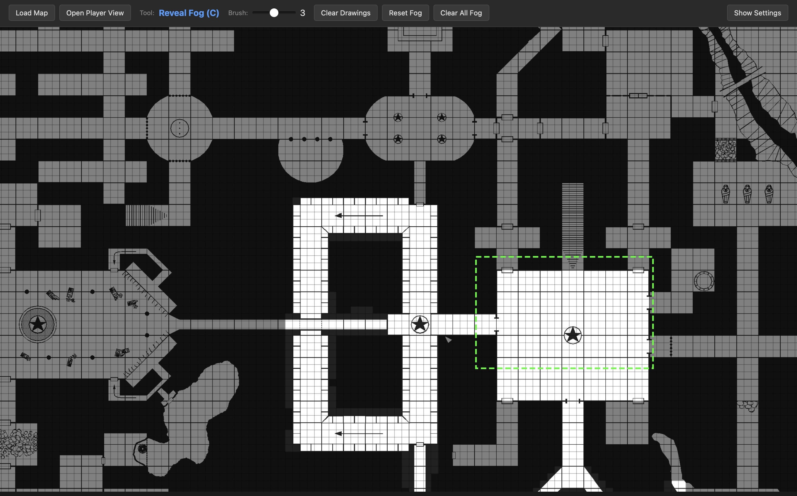
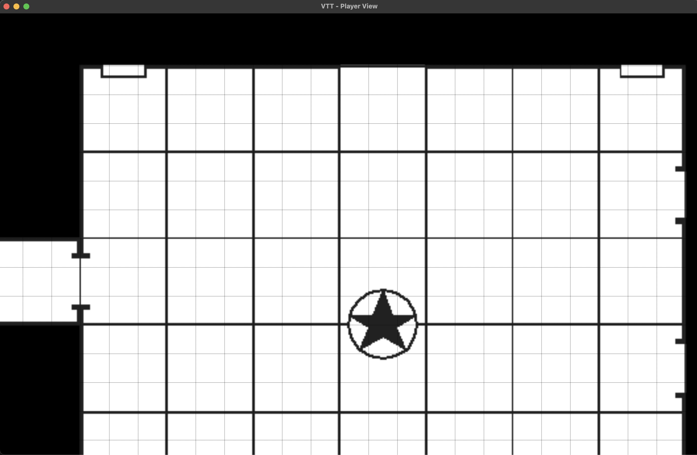

# VTT - Virtual Tabletop

A lightweight virtual tabletop application for running tabletop RPGs on a TV. Features a DM view for controlling the map and a separate player view designed for display on a TV or second monitor.

## Screenshots

### GM View


The GM view shows the full map with semi-transparent fog of war, grid overlay, and a green dashed rectangle indicating what players can see. The toolbar provides quick access to fog tools, drawing controls, and settings.

### Player View


The player view is a clean, distraction-free window designed for display on a TV. It shows only the revealed portions of the map with solid fog of war hiding unexplored areas.

## Features

### DM View
- **Map Loading**: Load any image file as your battle map
- **Grid Overlay**: Configurable grid with adjustable size, color, opacity, and offset
- **Fog of War**: Reveal and hide areas of the map with adjustable brush sizes
- **Drawing Tools**: Annotate the map with freehand drawings
- **Laser Pointer**: Temporarily highlight areas (visible to players in real-time)
- **Pan & Zoom**: Navigate large maps easily
- **Player Viewport Indicator**: See exactly what players can see (green dashed rectangle)

### Player View
- **Calibrated Display**: Automatically scales so 1 grid square = 1 inch on your TV
- **Clean Interface**: No UI elements - just the map, fog, and drawings
- **Real-time Sync**: Reflects DM's fog reveals, drawings, and laser pointer

### Persistence
- Map state (fog, drawings, grid settings, calibration) is automatically saved
- Reopen a map and pick up exactly where you left off

## Installation

### Download
Download the latest release for your platform from the [Releases](https://github.com/yourusername/vtt/releases) page:
- **macOS**: `.dmg` installer (available for both Apple Silicon and Intel)
- **Windows**: `.msi` or `.exe` installer

### Build from Source

Prerequisites:
- Node.js 20+
- Rust (stable)

```bash
# Clone the repository
git clone https://github.com/yourusername/vtt.git
cd vtt

# Install dependencies
npm install

# Run in development mode
npm run tauri dev

# Build for production
npm run tauri build
```

## Usage

### Getting Started

1. **Open DM View**: Launch the application
2. **Load a Map**: Click "Load Map" and select an image file
3. **Configure Grid**: Adjust grid size to match your map's grid
4. **Open Player View**: Click "Open Player View" to launch the player window
5. **Position Player View**: Drag the player window to your TV/second monitor

### Keyboard Shortcuts

#### Tools
| Key | Action |
|-----|--------|
| `C` | Fog reveal (clear) |
| `F` | Fog hide |
| `E` | Draw tool (pen) |
| `R` | Laser pointer |

#### Navigation
| Key | Action |
|-----|--------|
| `WASD` | Pan DM view |
| `Shift+WASD` | Move player viewport |
| `Scroll wheel` | Zoom DM view |

#### Calibration
| Key | Action |
|-----|--------|
| `-` / `=` | Adjust player view scale (PPI) |
| `Shift+R` | Reset calibration to saved value |

#### Grid
| Key | Action |
|-----|--------|
| `Shift+G` | Start grid calibration mode |
| `Shift+IJKL` | Nudge grid offset (1px) |

*In grid calibration mode:*
| Key | Action |
|-----|--------|
| `[` | Grid too big (shrink) |
| `]` | Grid too small (grow) |
| `Enter` | Confirm grid size |
| `Escape` | Cancel |

#### History
| Key | Action |
|-----|--------|
| `Ctrl/Cmd+Z` | Undo |
| `Ctrl/Cmd+Shift+Z` | Redo |
| `Ctrl/Cmd+Y` | Redo |

### Tools

- **Fog Reveal**: Click/drag to reveal hidden areas to players
- **Fog Hide**: Click/drag to hide areas from players
- **Draw**: Freehand drawing that persists on the map
- **Laser**: Temporary pointer that disappears when you release

## Development

```bash
# Start development server
npm run tauri dev

# Type check
npx tsc --noEmit

# Build production app
npm run tauri build
```

## Tech Stack

- **Frontend**: React 19, TypeScript, Vite
- **Canvas**: Konva / react-konva
- **Desktop**: Tauri 2.0
- **Persistence**: Tauri FS plugin (saves to app data directory)

## License

MIT
